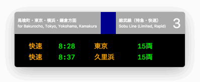

# :train: DepartureBoard2017Feb



## Usage

```bash
git clone git@github.com:keisei1092/DepartureBoard2017Feb.git
yarn install
yarn start
```

## Examples

Sobu Line (Rapid service)

```javascript
// route.js
module.exports = {
  destination: '馬喰町・東京・横浜・鎌倉方面',
  destinationSub: 'for Bakurocho, Tokyo, Yokohama, Kamakura',
  color: 'darkblue',
  name: '総武線（特急・快速）',
  nameSub: 'Sobu Line (Limited, Rapid)',
  platformNumber: '3'
};

// times.js
[
  TimeTableElement({ klassName: 'text-orange bilingual', dataJapanese: '快速', dataEnglish: 'RAPID' }),
  TimeTableElement({ text: '8:28' }),
  TimeTableElement({ klassName: 'text-orange bilingual', dataJapanese: '東京', dataEnglish: 'Tokyo' }),
  TimeTableElement({ klassName: 'bilingual', dataJapanese: '15両', dataEnglish: '15 Cars' })
],
[
  TimeTableElement({ klassName: 'text-orange bilingual', dataJapanese: '快速', dataEnglish: 'RAPID' }),
  TimeTableElement({ text: '8:37' }),
  TimeTableElement({ klassName: 'text-orange bilingual', dataJapanese: '久里浜', dataEnglish: 'Kurihama' }),
  TimeTableElement({ klassName: 'bilingual', dataJapanese: '15両', dataEnglish: '15 Cars' })
]
```

Yamanote Line

```javascript
// route.js
module.exports = {
  destination: '新宿・池袋方面',
  destinationSub: 'for Shinjuku, Ikebukuro',
  color: 'lime',
  name: '山手線（外回り）',
  nameSub: 'Yamanote Line',
  platformNumber: '2'
};

// times.js
[
  TimeTableElement({ klassName: 'bilingual', dataJapanese: '山手線', dataEnglish: 'Yamanote Line' }),
  TimeTableElement({ klassName: 'text-orange bilingual', dataJapanese: '新宿・池袋方面', dataEnglish: 'Shinjuku & Ikebukuro' }),
  TimeTableElement({ text: '8:28' })
],
[
  TimeTableElement({ klassName: 'bilingual', dataJapanese: '山手線', dataEnglish: 'Yamanote Line' }),
  TimeTableElement({ klassName: 'text-orange bilingual', dataJapanese: '新宿・池袋方面', dataEnglish: 'Shinjuku & Ikebukuro' }),
  TimeTableElement({ text: '8:37' })
]
```

## Next updates

* Configure route labels on app
* Update trains randomly
* Train is approaching
* Sound
